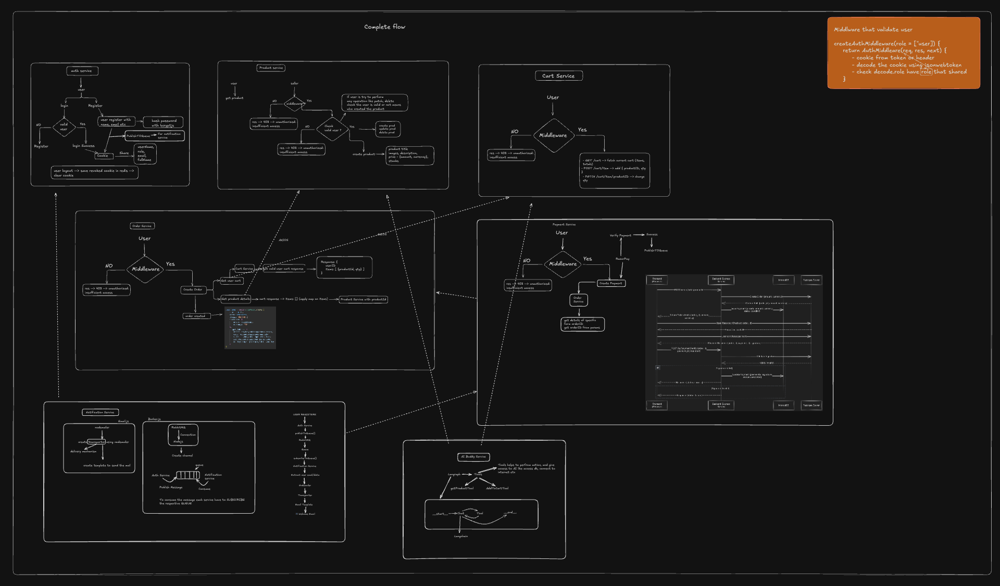
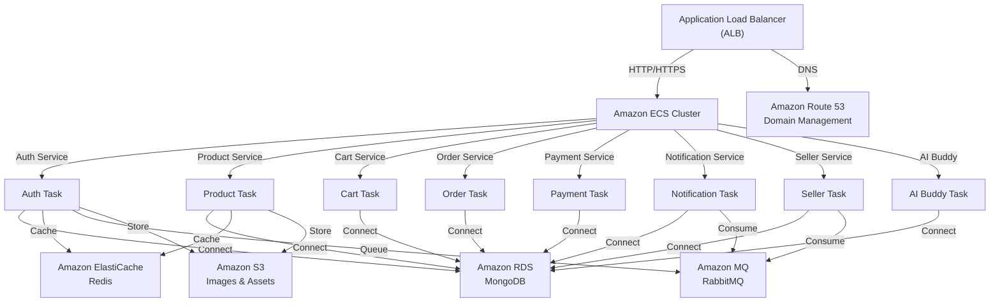
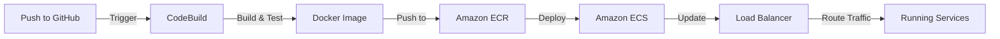
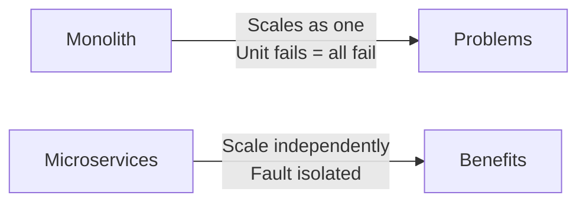
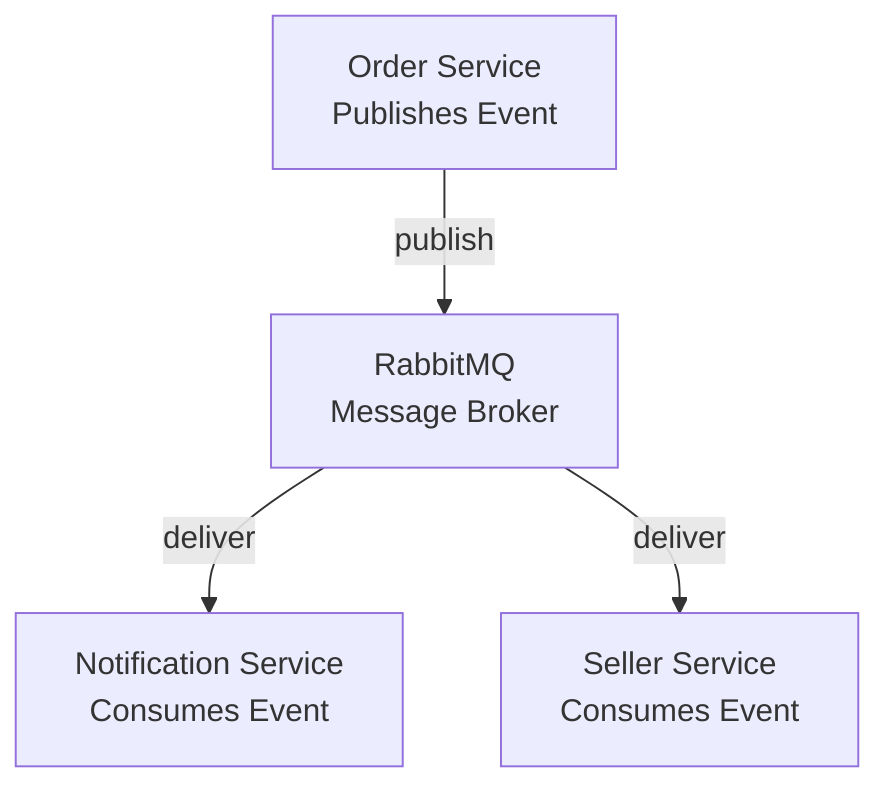
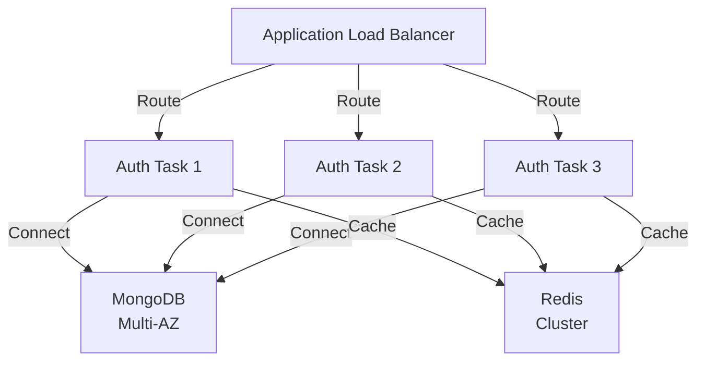
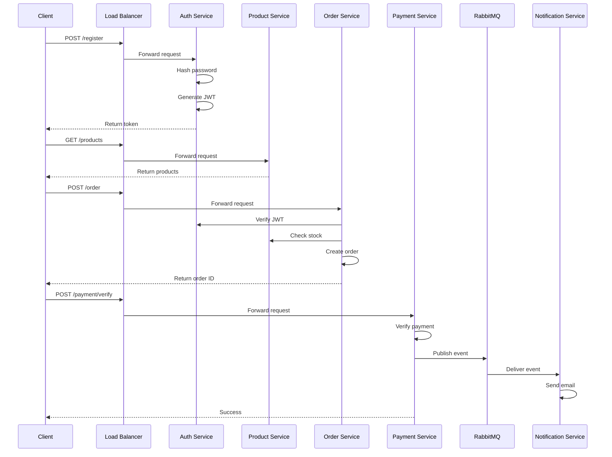
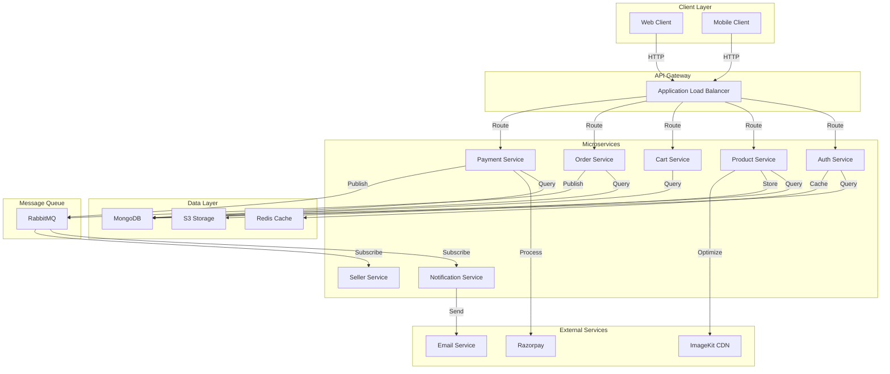

# 🛒 ShopCart — E-Commerce Backend

> ShopCart is a backend-only e-commerce application built using a microservices architecture, featuring authentication, product and cart management, order processing, Razorpay payments, seller operations, notifications, and an AI-powered assistant. The services communicate through REST APIs and RabbitMQ-based asynchronous events.

## 📌 Overview

ShopCart is a backend-only e-commerce application built using a microservices architecture.

The application is divided into independent services, with each service responsible for a specific business domain such as authentication, product management, cart management, order processing, payments, seller operations, notifications, and AI assistance.

The services communicate through REST APIs for synchronous operations and **RabbitMQ** for asynchronous, event-driven communication. **Razorpay** is integrated for payment processing and verification.

The project is containerized using **Docker** and deployed on **AWS ECS**, with **Amazon ECR** used for container images and **Application Load Balancer** for routing external HTTP traffic.

## ✨ Features

### 🔐 Authentication & Authorization

- User registration and login
- JWT-based authentication
- Cookie-based session handling
- Role-based authorization
- Protected routes using authentication middleware

### 📦 Product Management

- Create and manage products
- Fetch product details
- Product ownership and role validation
- Product data validation

### 🛒 Cart Management

- Add products to cart
- Update cart items
- Remove products from cart
- Fetch authenticated user's cart
- Product validation through service communication

### 📋 Order Management

- Create orders from cart items
- Validate products and quantities
- Store order and shipping information
- Track order status
- Authenticated order operations

### 💳 Payment Processing

- Razorpay payment integration
- Create payment orders
- Store payment records
- Payment verification
- Payment status management
- Payment-related event publishing

### 📨 Event-Driven Communication

- RabbitMQ-based asynchronous communication
- Event publishing between services
- Decoupled notification and seller workflows
- Payment-related event processing

### 🔔 Notification Service

- Process payment-related events
- Handle asynchronous notification workflows
- Consume events from RabbitMQ

### 🏪 Seller Service

- Seller-related operations
- Process seller dashboard events
- Consume payment-related events through RabbitMQ

### 🤖 AI Buddy

- AI-powered assistant
- Context-aware interaction with the application
- Dedicated AI Buddy service

## 🏗️ Architecture

### System Architecture

The application follows a **microservices-based architecture**, where each major business capability is separated into an independent service.



### Services

The system is divided into the following services:

- **Auth Service** — Handles user registration, login, authentication and authorization.
- **Product Service** — Handles product creation, updates, deletion and product retrieval.
- **Cart Service** — Manages user shopping carts and cart items.
- **Order Service** — Handles order creation and order management.
- **Payment Service** — Handles payment creation and payment verification.
- **Notification Service** — Handles asynchronous notifications.
- **Seller Service** — Handles seller-related functionality.
- **AI Buddy** — Provides AI-powered assistance for the application.

### Service-to-Service Communication

Services communicate with each other using a combination of **synchronous REST APIs** and **asynchronous messaging**.

#### Synchronous Communication

REST APIs are used when a service requires an immediate response from another service.

For example:

- Order Service → Product Service
- Order Service → Cart Service
- Payment Service → Order Service
- Other internal service-to-service API calls

#### Asynchronous Communication

**RabbitMQ** is used for asynchronous communication where the operation does not require an immediate response.

For example:

- Payment/Order events → Notification Service
- Services publish events to RabbitMQ.
- Notification Service consumes these events and processes the required notification.

This approach keeps services loosely coupled and allows background operations to be handled independently.

## 🔄 Application Flows

### Authentication Flow

1. Client sends registration/login request to the Auth Service.
2. Auth Service validates the request and performs the required authentication operation.
3. On successful authentication, JWT credentials are generated.
4. Authentication credentials are returned/stored using cookies.
5. Protected services validate the authenticated user before processing requests.

[!Authentication](assets/image.png)
[!](assets/image1.png)

### Product Flow

1. Client sends a product request to the Product Service.
2. Product Service validates the request and authenticated user.
3. Product data is stored/retrieved from the product database.
4. Product Service returns the requested product information.

[!](assets/prod-1.png)
[!](assets/prod-2.png)

### Cart Flow

1. Client sends a cart operation to the Cart Service.
2. Cart Service authenticates the user.
3. Product Service is contacted to validate product information when required.
4. Cart Service updates or retrieves the user's cart.
5. The updated cart data is returned to the client.

[!](assets/cart-1.png)
[!](assets/cart-2.png)

### Order Flow

1. Client initiates the order process.
2. Order Service validates the authenticated user and order details.
3. Required product and cart information is validated through service communication.
4. Order Service creates and stores the order.
5. The order is prepared for the payment process.

[!](assets/order-1.png)
[!](assets/order-2.png)

### Payment Flow

1. Client initiates payment for an order.
2. Payment Service creates a payment order using Razorpay.
3. Payment details are returned to the client.
4. Client completes the payment through Razorpay.
5. Payment Service verifies the payment.
6. Payment status is stored in the payment database.
7. Relevant payment events are published through RabbitMQ.

[!](assets/payment.png)

### Notification Flow

1. Payment/Order related events are published to RabbitMQ.
2. Notification Service consumes the relevant event.
3. Notification Service processes the event.
4. The required notification workflow is executed asynchronously.

[!](assets/noti.png)

### Seller Flow

1. Relevant order/payment events are published through RabbitMQ.
2. Seller Service consumes the required events.
3. Seller-related data and operations are processed asynchronously.
4. Seller information can be used for seller-side operations and dashboard workflows.

[!](assets/seller.png)

### AI Buddy Flow

1. Client sends a request to the AI Buddy Service.
2. AI Buddy processes the request using the configured AI integration.
3. The generated response is returned to the client.

[!](assets/ai.png)

## 📨 RabbitMQ Event Architecture

RabbitMQ is used as the message broker for asynchronous communication between services.

Instead of tightly coupling services through direct HTTP calls for every operation, services can publish events to RabbitMQ, which are then consumed by the services responsible for processing them.

### Event Flow

```
Producer Service
       │
       │ Publish Event
       ▼
   ┌─────────┐
   │ RabbitMQ│
   └────┬────┘
        │
        ├──────────────► Notification Service
        │
        └──────────────► Seller Service
        └──────────────► Payment Service
```

Benefits

- Asynchronous communication between services
- Loose coupling between microservices
- Independent event processing
- Better scalability for background workflows
- Services can consume events without directly depending on the producer

## 🔐 Authentication & Authorization

Authentication and authorization are handled by the **Auth Service** using **JWT-based authentication**.

### Authentication Flow

1. User registers or logs in through the Auth Service.
2. Auth Service validates the credentials.
3. Passwords are securely hashed and verified.
4. On successful authentication, a JWT is generated.
5. The JWT is stored in an HTTP cookie.
6. Protected requests are authenticated using the JWT.
7. On logout, the token is blacklisted to prevent further use.

### Authorization

Role-based authorization is implemented to control access to protected resources.

- Authentication middleware verifies the JWT.
- User information is extracted from the authenticated request.
- Role-based middleware validates the user's permissions.
- Protected operations are accessible only to authorized users.

### Token Blacklisting

The application implements **JWT token blacklisting** to invalidate tokens before their natural expiration.

When a user logs out:

1. The JWT is extracted from the request.
2. The token is added to the blacklist.
3. Subsequent requests containing the blacklisted token are rejected.
4. This prevents a previously issued token from being reused after logout.

### Security

- Passwords are hashed before being stored.
- JWT is used for stateless authentication.
- HTTP cookies are used to handle authentication credentials.
- Token blacklisting is implemented for token invalidation.
- Protected routes require valid authentication.
- Role-based access control prevents unauthorized operations.

## 🗄️ Database

ShopCart uses **MongoDB** as the primary database, with **Mongoose** as the ODM for schema definition, validation, and database operations.

### Database Architecture

Each microservice is responsible for its own domain-specific data. This keeps the services loosely coupled and allows them to manage their data independently.

### Database Responsibilities

| Service                  | Data Managed                                            |
| ------------------------ | ------------------------------------------------------- |
| **Auth Service**         | Users, credentials, roles, and blacklisted tokens       |
| **Product Service**      | Products and product-related information                |
| **Cart Service**         | User carts and cart items                               |
| **Order Service**        | Orders, order items, shipping details, and order status |
| **Payment Service**      | Payment records and payment status                      |
| **Seller Service**       | Seller-related information and operations               |
| **Notification Service** | Notification-related data                               |
| **AI Buddy**             | AI-related application data, if applicable              |

### MongoDB & Mongoose

- MongoDB is used for persistent data storage.
- Mongoose provides schemas and models for each service.
- Schema validation is used to maintain data consistency.
- Services interact with their respective collections through Mongoose.
- Database credentials and connection strings are managed using environment variables.

## 🛠️ Tech Stack

### Backend

- **Node.js** — JavaScript runtime
- **Express.js** — REST API development
- **JavaScript** — Application development

### Database

- **MongoDB** — Primary database
- **Mongoose** — ODM for MongoDB

### Authentication & Security

- **JWT** — Authentication and authorization
- **HTTP Cookies** — Token storage
- **Password Hashing** — Secure password storage
- **Token Blacklisting** — JWT invalidation after logout

### Microservices & Communication

- **Microservices Architecture** — Independent business services
- **REST APIs** — Synchronous service communication
- **RabbitMQ** — Asynchronous event-driven communication

### Payments

- **Razorpay** — Payment processing and payment verification

### AI

- **AI API** — AI-powered assistant through the AI Buddy service

### DevOps & Deployment

- **Docker** — Containerization
- **Amazon ECR** — Docker image storage
- **Amazon ECS** — Container orchestration and deployment
- **Application Load Balancer (ALB)** — Traffic routing
- **Amazon VPC** — Network isolation and infrastructure

## 📁 Project Structure

```text
.
├── AI-buddy/
│   ├── package.json
│   ├── server.js
│   └── src/
│       ├── agent/
│       │   ├── agent.js
│       │   └── tools.js
│       ├── app.js
│       ├── db/
│       │   └── db.js
│       ├── model/
│       │   └── message.model.js
│       └── socket/
│           └── socket.server.js
│
├── Auth/
│   ├── __test__/
│   ├── tests/
│   ├── dockerfile
│   ├── jest.config.js
│   ├── package.json
│   ├── server.js
│   └── src/
│       ├── app.js
│       ├── broker/
│       ├── controller/
│       ├── db/
│       ├── middleware/
│       ├── model/
│       ├── models/
│       └── routes/
│
├── Order/
│   ├── test/
│   ├── dockerfile
│   ├── jest.config.js
│   ├── package.json
│   ├── server.js
│   └── src/
│       ├── app.js
│       ├── broker/
│       ├── controllers/
│       ├── db/
│       ├── middleware/
│       ├── models/
│       ├── routes/
│       └── validators/
│
├── cart/
│   ├── test/
│   ├── dockerfile
│   ├── jest.config.js
│   ├── package.json
│   ├── server.js
│   └── src/
│       ├── app.js
│       ├── controller/
│       ├── db/
│       ├── middleware/
│       ├── model/
│       ├── routes/
│       └── validators/
│
├── notification/
│   ├── package.json
│   ├── server.js
│   └── src/
│       ├── app.js
│       ├── broker/
│       └── email.js
│
├── payments/
│   ├── dockerfile
│   ├── package.json
│   ├── server.js
│   └── src/
│       ├── app.js
│       ├── broker/
│       ├── controller/
│       ├── db/
│       ├── middleware/
│       ├── models/
│       └── routes/
│
├── product/
│   ├── dockerfile
│   ├── package.json
│   ├── server.js
│   └── src/
│       ├── app.js
│       ├── broker/
│       ├── controller/
│       ├── db/
│       ├── middleware/
│       ├── model/
│       ├── routes/
│       ├── service/
│       └── validators/
│
├── seller-dashboard/
│   ├── package.json
│   ├── server.js
│   └── src/
│       ├── app.js
│       ├── broker/
│       ├── controllers/
│       ├── db/
│       ├── middleware/
│       ├── models/
│       └── routes/
│
├── devMap.excalidraw
└── README.md
```

## 🚀 Getting Started

### Prerequisites

Make sure the following are installed and configured before running the project:

- Node.js (v18+)
- npm
- MongoDB
- Redis
- RabbitMQ
- Git

External services / APIs:

- ImageKit
- Payment Gateway
- Groq API

The AI Buddy service is built using:

- LangChain
- LangGraph
- Groq

---

### Environment Variables

Each microservice has its own `.env` file.

Create a `.env` file inside each service directory and add the required environment variables.

Example:

```env
PORT=5000

MONGO_URI=your_mongodb_connection_string

JWT_SECRET=your_jwt_secret

REDIS_URL=your_redis_connection_url

RABBITMQ_URL=your_rabbitmq_connection_url

IMAGEKIT_PRIVATE_KEY=your_imagekit_private_key
IMAGEKIT_PUBLIC_KEY=your_imagekit_public_key
IMAGEKIT_URL_ENDPOINT=your_imagekit_url_endpoint

PAYMENT_KEY=your_payment_gateway_key
PAYMENT_SECRET=your_payment_gateway_secret

GROQ_API_KEY=your_groq_api_key
```

### Installation

Clone the repository:

```bash
git clone <your-repository-url>
cd <project-directory>
```

### Running Locally

Make sure MongoDB, Redis, and RabbitMQ are running.

Start each microservice from its respective directory:

```bash
cd Auth
npm start
```

## 🧪 API Documentation

The project exposes REST APIs for each microservice.

### Auth APIs

#### Register User

```http
POST /auth/register
Content-Type: application/json

{
  "email": "user@example.com",
  "password": "securePassword123",
  "name": "John Doe"
}
```

**Response:** `201 Created`

```json
{
  "success": true,
  "message": "User registered successfully",
  "user": {
    "id": "userId",
    "email": "user@example.com",
    "name": "John Doe"
  },
  "token": "jwt_token"
}
```

#### Login User

```http
POST /auth/login
Content-Type: application/json

{
  "email": "user@example.com",
  "password": "securePassword123"
}
```

**Response:** `200 OK`

```json
{
  "success": true,
  "message": "Login successful",
  "token": "jwt_token"
}
```

#### Get Current User

```http
GET /auth/me
Authorization: Bearer <jwt_token>
```

**Response:** `200 OK`

```json
{
  "success": true,
  "user": {
    "id": "userId",
    "email": "user@example.com",
    "name": "John Doe",
    "role": "customer"
  }
}
```

#### Logout

```http
POST /auth/logout
Authorization: Bearer <jwt_token>
```

**Response:** `200 OK`

```json
{
  "success": true,
  "message": "Logout successful"
}
```

#### Get User Addresses

```http
GET /auth/addresses
Authorization: Bearer <jwt_token>
```

**Response:** `200 OK`

```json
{
  "success": true,
  "addresses": [
    {
      "id": "addressId",
      "street": "123 Main St",
      "city": "New York",
      "state": "NY",
      "zipCode": "10001",
      "country": "USA"
    }
  ]
}
```

### Product APIs

#### Create Product

```http
POST /product
Authorization: Bearer <jwt_token>
Content-Type: application/json

{
  "name": "Laptop",
  "description": "High-performance laptop",
  "price": 999.99,
  "stock": 50,
  "category": "Electronics"
}
```

**Response:** `201 Created`

```json
{
  "success": true,
  "product": {
    "id": "productId",
    "name": "Laptop",
    "price": 999.99,
    "stock": 50
  }
}
```

#### Get All Products

```http
GET /product?page=1&limit=10
```

**Response:** `200 OK`

```json
{
  "success": true,
  "products": [...],
  "pagination": {
    "page": 1,
    "limit": 10,
    "total": 100
  }
}
```

#### Get Product by ID

```http
GET /product/:id
```

**Response:** `200 OK`

```json
{
  "success": true,
  "product": {
    "id": "productId",
    "name": "Laptop",
    "description": "High-performance laptop",
    "price": 999.99,
    "stock": 50
  }
}
```

#### Update Product

```http
PATCH /product/:id
Authorization: Bearer <jwt_token>
Content-Type: application/json

{
  "price": 899.99,
  "stock": 45
}
```

**Response:** `200 OK`

```json
{
  "success": true,
  "product": {...}
}
```

#### Delete Product

```http
DELETE /product/:id
Authorization: Bearer <jwt_token>
```

**Response:** `200 OK`

```json
{
  "success": true,
  "message": "Product deleted successfully"
}
```

### Cart APIs

#### Get Cart

```http
GET /cart
Authorization: Bearer <jwt_token>
```

**Response:** `200 OK`

```json
{
  "success": true,
  "cart": {
    "id": "cartId",
    "userId": "userId",
    "items": [
      {
        "productId": "productId",
        "quantity": 2,
        "price": 999.99
      }
    ],
    "total": 1999.98
  }
}
```

#### Add to Cart

```http
POST /cart/items
Authorization: Bearer <jwt_token>
Content-Type: application/json

{
  "productId": "productId",
  "quantity": 2
}
```

**Response:** `201 Created`

```json
{
  "success": true,
  "cart": {...}
}
```

#### Update Cart Item

```http
PATCH /cart/items/:itemId
Authorization: Bearer <jwt_token>
Content-Type: application/json

{
  "quantity": 3
}
```

**Response:** `200 OK`

```json
{
  "success": true,
  "cart": {...}
}
```

#### Remove from Cart

```http
DELETE /cart/items/:itemId
Authorization: Bearer <jwt_token>
```

**Response:** `200 OK`

```json
{
  "success": true,
  "message": "Item removed from cart"
}
```

### Order APIs

#### Create Order

```http
POST /order
Authorization: Bearer <jwt_token>
Content-Type: application/json

{
  "items": [
    {
      "productId": "productId",
      "quantity": 2,
      "price": 999.99
    }
  ],
  "shippingAddress": {
    "street": "123 Main St",
    "city": "New York",
    "state": "NY",
    "zipCode": "10001"
  }
}
```

**Response:** `201 Created`

```json
{
  "success": true,
  "order": {
    "id": "orderId",
    "userId": "userId",
    "items": [...],
    "totalAmount": 1999.98,
    "status": "pending",
    "createdAt": "2024-01-15T10:30:00Z"
  }
}
```

#### Get Order by ID

```http
GET /order/:id
Authorization: Bearer <jwt_token>
```

**Response:** `200 OK`

```json
{
  "success": true,
  "order": {...}
}
```

#### Get User Orders

```http
GET /order
Authorization: Bearer <jwt_token>
```

**Response:** `200 OK`

```json
{
  "success": true,
  "orders": [...]
}
```

#### Cancel Order

```http
PATCH /order/:id/cancel
Authorization: Bearer <jwt_token>
```

**Response:** `200 OK`

```json
{
  "success": true,
  "order": {
    "id": "orderId",
    "status": "cancelled"
  }
}
```

### Payment APIs

#### Create Payment Order

```http
POST /payment/create-order
Authorization: Bearer <jwt_token>
Content-Type: application/json

{
  "orderId": "orderId",
  "amount": 1999.98,
  "currency": "INR"
}
```

**Response:** `201 Created`

```json
{
  "success": true,
  "payment": {
    "id": "razorpayOrderId",
    "amount": 1999.98,
    "currency": "INR",
    "status": "created"
  }
}
```

#### Verify Payment

```http
POST /payment/verify
Authorization: Bearer <jwt_token>
Content-Type: application/json

{
  "razorpay_order_id": "order_id",
  "razorpay_payment_id": "pay_id",
  "razorpay_signature": "signature"
}
```

**Response:** `200 OK`

```json
{
  "success": true,
  "message": "Payment verified successfully",
  "payment": {
    "id": "paymentId",
    "status": "verified"
  }
}
```

#### Get Payment Status

```http
GET /payment/:paymentId
Authorization: Bearer <jwt_token>
```

**Response:** `200 OK`

```json
{
  "success": true,
  "payment": {
    "id": "paymentId",
    "orderId": "orderId",
    "amount": 1999.98,
    "status": "verified"
  }
}
```

### Seller APIs

#### Get Seller Dashboard

```http
GET /seller/dashboard
Authorization: Bearer <jwt_token>
```

**Response:** `200 OK`

```json
{
  "success": true,
  "dashboard": {
    "totalOrders": 150,
    "totalRevenue": 50000.00,
    "pendingOrders": 25,
    "recentOrders": [...]
  }
}
```

#### Get Seller Stats

```http
GET /seller/stats
Authorization: Bearer <jwt_token>
```

**Response:** `200 OK`

```json
{
  "success": true,
  "stats": {
    "ordersPerDay": [...],
    "revenuePerDay": [...],
    "topProducts": [...]
  }
}
```

### AI Buddy APIs

#### Send Message

```http
POST /ai-buddy/chat
Content-Type: application/json

{
  "message": "What products are available?",
  "context": {
    "userId": "userId"
  }
}
```

**Response:** `200 OK`

```json
{
  "success": true,
  "response": "Based on the current inventory, we have laptops, phones, and accessories available...",
  "messageId": "messageId"
}
```

#### Get Chat History

```http
GET /ai-buddy/history
```

**Response:** `200 OK`

```json
{
  "success": true,
  "messages": [
    {
      "id": "messageId",
      "content": "What products are available?",
      "response": "...",
      "timestamp": "2024-01-15T10:30:00Z"
    }
  ]
}
```

## 🧪 Testing

The project uses **Jest** for unit and integration testing. Each service includes comprehensive test suites.

### Running Tests

```bash
# Run all tests for a service
cd Auth
npm test

# Run tests with coverage
npm test -- --coverage

# Run specific test file
npm test -- auth.login.test.js
```

### Test Structure

Each service includes tests in the following directories:

- `__test__/` - Unit tests for authentication
- `test/` - Integration tests for business logic

### Example Test Cases

#### Auth Tests

- User registration validation
- Login authentication
- JWT token generation
- Token blacklisting on logout
- User profile retrieval
- Address management

#### Product Tests

- Product creation and validation
- Product retrieval and filtering
- Product update and deletion
- Product ownership verification

#### Cart Tests

- Add items to cart
- Update cart quantities
- Remove items from cart
- Cart total calculation

#### Order Tests

- Order creation from cart
- Order status tracking
- Order cancellation
- Order history retrieval

#### Payment Tests

- Payment order creation
- Payment verification
- Payment status tracking

### Testing Coverage

- Unit Tests: Service logic, controllers, models
- Integration Tests: Service-to-service communication
- API Tests: REST endpoint validation

## 🐳 Docker

Each microservice is containerized using Docker. Docker images are stored in **Amazon ECR** and deployed using **Amazon ECS**.

### Dockerfile Structure

Each service has a `dockerfile` at the root level following this structure:

```dockerfile
# Base image
FROM node:18-alpine

# Set working directory
WORKDIR /app

# Copy package files
COPY package.json package-lock.json ./

# Install dependencies
RUN npm ci --only=production

# Copy application code
COPY . .

# Expose port
EXPOSE 5000

# Health check
HEALTHCHECK --interval=30s --timeout=3s --start-period=5s --retries=3 \
  CMD node healthcheck.js

# Start the service
CMD ["npm", "start"]
```

### Building Docker Images

```bash
# Build image for Auth service
docker build -t ecommerce-auth:latest ./Auth

# Build image for Product service
docker build -t ecommerce-product:latest ./product

# Tag image for ECR
docker tag ecommerce-auth:latest <aws_account_id>.dkr.ecr.<region>.amazonaws.com/ecommerce-auth:latest
```

### Running Docker Containers Locally

```bash
# Run Auth service
docker run -p 5000:5000 \
  -e MONGO_URI=mongodb://localhost:27017/auth \
  -e JWT_SECRET=your_secret \
  ecommerce-auth:latest

# Run with Docker Compose (if available)
docker-compose up -d
```

### Multi-Service Orchestration

Services communicate through a Docker network:

```bash
docker network create ecommerce-network

docker run --network ecommerce-network --name auth-service ecommerce-auth:latest
docker run --network ecommerce-network --name product-service ecommerce-product:latest
```

## ☁️ AWS Deployment

### AWS Architecture



### AWS Services Used

| Service                       | Purpose                                   | Configuration                           |
| ----------------------------- | ----------------------------------------- | --------------------------------------- |
| **Application Load Balancer** | Route external traffic to ECS tasks       | Multi-AZ, port 80/443                   |
| **Amazon ECS**                | Container orchestration for microservices | Fargate launch type, auto-scaling       |
| **Amazon ECR**                | Docker image registry                     | Private repository per service          |
| **Amazon RDS**                | MongoDB managed database                  | Multi-AZ, automated backups             |
| **Amazon ElastiCache**        | Redis cache for sessions and data         | Multi-AZ replication                    |
| **Amazon MQ**                 | RabbitMQ message broker                   | Single broker with failover             |
| **Amazon S3**                 | Object storage for images and assets      | Versioning, lifecycle policies          |
| **Amazon Route 53**           | DNS and domain management                 | Health checks, routing policies         |
| **Amazon VPC**                | Network isolation                         | Public/private subnets, security groups |
| **AWS CloudWatch**            | Monitoring and logging                    | Metrics, logs, alarms                   |

### Deployment Flow



### Deployment Steps

1. **Build & Push Images**

   ```bash
   # Authenticate with ECR
   aws ecr get-login-password --region us-east-1 | docker login --username AWS --password-stdin <account_id>.dkr.ecr.us-east-1.amazonaws.com

   # Build and push
   docker build -t ecommerce-auth:latest ./Auth
   docker tag ecommerce-auth:latest <account_id>.dkr.ecr.us-east-1.amazonaws.com/ecommerce-auth:latest
   docker push <account_id>.dkr.ecr.us-east-1.amazonaws.com/ecommerce-auth:latest
   ```

2. **Update ECS Task Definition**

   ```bash
   # Update task definition with new image
   aws ecs register-task-definition \
     --family ecommerce-auth \
     --container-definitions '[{"name":"auth","image":"<ecr_image_url>:latest","memory":512,"portMappings":[{"containerPort":5000}]}]'
   ```

3. **Update ECS Service**

   ```bash
   aws ecs update-service \
     --cluster ecommerce-cluster \
     --service auth-service \
     --task-definition ecommerce-auth:latest \
     --force-new-deployment
   ```

4. **Monitor Deployment**
   ```bash
   # Check service status
   aws ecs describe-services \
     --cluster ecommerce-cluster \
     --services auth-service
   ```

## 📊 Error Handling & Validation

### Error Response Format

All API errors follow a consistent format:

```json
{
  "success": false,
  "error": {
    "code": "ERROR_CODE",
    "message": "Human-readable error message",
    "statusCode": 400,
    "details": {
      "field": "fieldName",
      "issue": "Specific validation issue"
    }
  }
}
```

### HTTP Status Codes

| Code    | Scenario                                 |
| ------- | ---------------------------------------- |
| **200** | Successful GET, PATCH, DELETE            |
| **201** | Successful POST (resource created)       |
| **400** | Bad Request (validation errors)          |
| **401** | Unauthorized (missing/invalid token)     |
| **403** | Forbidden (insufficient permissions)     |
| **404** | Not Found (resource doesn't exist)       |
| **409** | Conflict (duplicate resource)            |
| **422** | Unprocessable Entity (validation failed) |
| **500** | Internal Server Error                    |
| **503** | Service Unavailable                      |

### Validation

Input validation is performed at multiple levels:

1. **Request Schema Validation**

   ```javascript
   // Middleware validates request body against schema
   const registerSchema = {
     email: { type: "email", required: true },
     password: { type: "string", minLength: 8, required: true },
     name: { type: "string", required: true },
   };
   ```

2. **Business Logic Validation**
   - User existence checks
   - Product availability verification
   - Stock availability checks
   - Payment verification

3. **Authorization Validation**
   - JWT token verification
   - Role-based access control
   - Resource ownership verification

### Common Error Scenarios

#### Authentication Errors

```json
{
  "success": false,
  "error": {
    "code": "INVALID_CREDENTIALS",
    "message": "Invalid email or password",
    "statusCode": 401
  }
}
```

#### Validation Errors

```json
{
  "success": false,
  "error": {
    "code": "VALIDATION_ERROR",
    "message": "Validation failed",
    "statusCode": 400,
    "details": [
      {
        "field": "email",
        "message": "Invalid email format"
      }
    ]
  }
}
```

#### Resource Not Found

```json
{
  "success": false,
  "error": {
    "code": "NOT_FOUND",
    "message": "Product not found",
    "statusCode": 404
  }
}
```

## 🧠 Design Decisions

### Why Microservices?

**Rationale:**

- **Independent Scaling** - Scale services based on individual demand
- **Technology Flexibility** - Different services can use different tech stacks
- **Fault Isolation** - Service failure doesn't cascade to others
- **Team Independence** - Teams can develop/deploy independently

**Trade-offs:**

- Increased complexity in deployment and monitoring
- Network latency between services
- Data consistency challenges across services



### Why RabbitMQ?

**Rationale:**

- **Asynchronous Processing** - Decouple time-dependent operations
- **Reliability** - Message persistence and delivery guarantees
- **Scalability** - Handle high-volume event streams
- **Loose Coupling** - Services don't need to know about each other

**Event Types:**

- Order confirmation events
- Payment success/failure events
- Notification delivery events
- Seller dashboard updates



### Why Docker?

**Rationale:**

- **Consistency** - Identical environments across dev, test, production
- **Isolation** - Each service runs in isolated container
- **Reproducibility** - Easy to replicate and scale
- **CI/CD Integration** - Seamless integration with deployment pipelines

**Benefits:**

- Simplified onboarding - developers run `docker-compose up`
- Easy rollbacks - revert to previous image version
- Resource efficiency - lightweight compared to VMs

### Why MongoDB?

**Rationale:**

- **Flexible Schema** - Adapt to changing data structures
- **Scalability** - Horizontal scaling with sharding
- **Replica Sets** - Built-in replication for high availability
- **Document Model** - Natural fit for microservices domain entities

**Trade-offs:**

- Not ACID-compliant at distributed level
- Higher memory consumption than relational DBs

### Why AWS ECS?

**Rationale:**

- **Managed Service** - No infrastructure management overhead
- **Scalability** - Auto-scaling based on metrics
- **Integration** - Seamless integration with other AWS services
- **Cost Effective** - Pay only for resources used
- **Security** - VPC isolation, IAM roles, encryption

## 📈 Scalability & Reliability

### Horizontal Scaling



### Auto-Scaling Policies

- **CPU Scaling** - Scale up when CPU > 70%, scale down when < 30%
- **Memory Scaling** - Scale up when memory > 80%, scale down when < 40%
- **Request Count** - Scale based on requests per task
- **Custom Metrics** - Application-specific metrics

### High Availability

**Multi-AZ Deployment:**

- Each service deployed across multiple availability zones
- Load balancer distributes traffic
- Automatic failover to healthy instances
- Database replication across AZs

**Health Checks:**

- ECS performs regular health checks
- Unhealthy tasks are automatically replaced
- Application-level health endpoints

**Database Redundancy:**

- MongoDB replica sets for high availability
- Automatic failover to secondary instances
- Regular backups to S3

### Rate Limiting

Each service implements rate limiting:

```javascript
// Per-IP rate limiting
const rateLimit = require("express-rate-limit");

const limiter = rateLimit({
  windowMs: 15 * 60 * 1000, // 15 minutes
  max: 100, // 100 requests per windowMs
});

app.use("/api/", limiter);
```

### Caching Strategy

- **Redis Cache** for frequently accessed data
- Cache invalidation on data updates
- TTL-based cache expiration
- Cache warming for critical data

### Circuit Breaker Pattern

```javascript
// Prevent cascading failures
const failureThreshold = 5;
const resetTimeout = 60000;

if (consecutiveFailures > failureThreshold) {
  // Open circuit - reject requests
  throwError("Service temporarily unavailable");
}
```

## 🔮 Future Improvements

### Planned Features

1. **Analytics & Reporting**
   - Real-time sales dashboard
   - Customer analytics
   - Inventory forecasting
   - Revenue reports

2. **Advanced Search**
   - Elasticsearch integration
   - Full-text search across products
   - Faceted search and filtering
   - Search suggestions and autocomplete

3. **Recommendation Engine**
   - Collaborative filtering
   - Content-based recommendations
   - Personalized product suggestions
   - Purchase prediction

4. **Enhanced Notifications**
   - SMS notifications
   - Push notifications
   - Email templates
   - Notification preferences

5. **Admin Dashboard**
   - System monitoring
   - User management
   - Service health dashboard
   - Analytics and reporting

6. **Performance Optimization**
   - GraphQL API for flexible queries
   - Redis caching optimization
   - Database query optimization
   - CDN integration for static assets

7. **Security Enhancements**
   - OAuth2/OIDC support
   - Two-factor authentication
   - API key management
   - DDoS protection

8. **Multi-language Support**
   - i18n integration
   - Currency conversion
   - Regional pricing

### Technical Debt

- Upgrade Node.js to latest LTS version
- Implement comprehensive logging with ELK stack
- Add distributed tracing with Jaeger
- Upgrade MongoDB driver to latest version
- Implement API versioning strategy

## 📸 Screenshots / Diagrams

### Complete System Flow



### Data Flow Diagram



## 👨‍💻 Author

**ShopCart Development Team**

- Developed as a modern microservices e-commerce platform
- Built with scalability, reliability, and maintainability in mind
- Containerized and deployed on AWS for production readiness

### Contributing

Contributions are welcome! Please follow the development guidelines:

1. Create a feature branch from `develop`
2. Make your changes with clear commit messages
3. Write tests for new functionality
4. Submit a pull request with description
5. Ensure all tests pass and code review is approved

### Development Workflow

```bash
# Clone repository
git clone <repository-url>
cd Ecommerce-Microservice

# Create feature branch
git checkout -b feature/your-feature

# Install dependencies for a service
cd <service-name>
npm install

# Run tests
npm test

# Start development
npm run dev

# Commit and push
git add .
git commit -m "Add your feature"
git push origin feature/your-feature
```

## 📄 License

This project is licensed under the **MIT License** - see the LICENSE file for details.

### License Summary

- ✅ **Permitted:** Commercial use, modification, distribution, private use
- ❌ **Forbidden:** Liability, warranty
- ℹ️ **Conditions:** License and copyright notice

---

### Support & Documentation

For issues, feature requests, or documentation improvements, please:

1. Check existing GitHub issues
2. Create a detailed bug report with reproduction steps
3. Include environment information (Node version, OS, etc.)
4. Provide relevant code snippets and error logs

### Quick Links

- **Issue Tracker:** [GitHub Issues](https://github.com)
- **Documentation:** [View Full Docs](https://github.com)
- **API Reference:** [Postman Collection](https://postman.com)
- **AWS Deployment Guide:** [See AWS Section](#aws-deployment)

---

**Last Updated:** August 31, 2026

```

```
